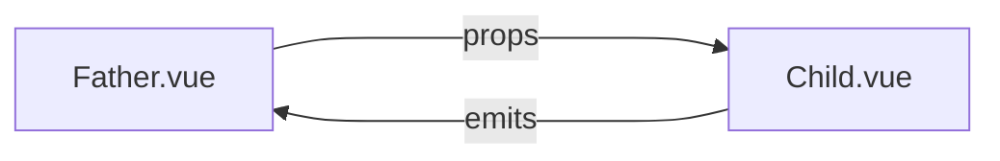

# 组件之间的通信

经过前面的那几部分的阅读，相信搭一个基础的 Vue 3.0 项目应该没什么问题了！

但实际业务开发过程中，还会遇到一些组件之间的通信问题，父子组件通信、兄弟组件通信、爷孙组件通信，还有一些全局通信的场景。

:::tip
这一章节的内容，`3.x` 对比 `2.x` 变化都比较大！
:::

这一章就按使用场景来划分对应的章节吧，在什么场景下遇到问题，也方便快速找到对应的处理办法。

## 父子组件通信

父子组件通信是指，B组件引入到A组件里渲染，此时A是B的父级；B组件的一些数据需要从A组件拿，B组件有时也要告知A组件一些数据变化情况。

为了方便阅读，下面的父组件统一叫 `Father.vue`，子组件统一叫 `Child.vue`。

可用方案|方案说明
:--|:--
props / emits|`Father.vue` 通过 props 向 `Child.vue` 传值 `Child.vue` 通过 emits 向 `Father.vue` 触发父组件的事件执行

画成一个流程图理解起来会比较直观一些：

## props / emits

这是Vue跨组件通信最简单，也是基础的一个方案。

### props

`props` 是在 **从父组件把数据传递给子组件** 这个过程中，充当传递桥梁的一个角色。

### emits

### 业务案例

## 兄弟组件通信

待完善

## 爷孙组件通信

待完善

## 全局通信

待完善

## 本节结语

待完善