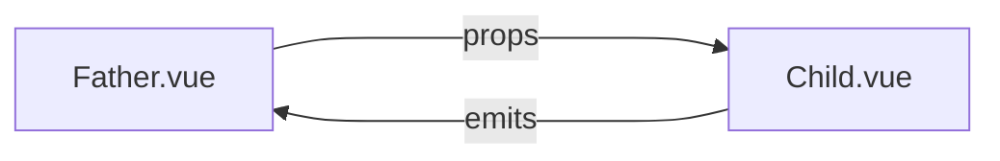

# 组件之间的通信

经过前面的那几部分的阅读，相信搭一个基础的 Vue 3.0 项目应该没什么问题了！

但实际业务开发过程中，还会遇到一些组件之间的通信问题，父子组件通信、兄弟组件通信、爷孙组件通信，还有一些全局通信的场景。

:::tip
这一章节的内容，`3.x` 对比 `2.x` 变化都比较大！
:::

这一章就按使用场景来划分对应的章节吧，在什么场景下遇到问题，也方便快速找到对应的处理办法。

## 父子组件通信

父子组件通信是指，B组件引入到A组件里渲染，此时A是B的父级；B组件的一些数据需要从A组件拿，B组件有时也要告知A组件一些数据变化情况。

为了方便阅读，下面的父组件统一叫 `Father.vue`，子组件统一叫 `Child.vue`。

## props / emits

这是Vue跨组件通信最简单，也是基础的一个方案，它的通信过程是：

1. `Father.vue` 通过 props 向 `Child.vue` 传值（可包含父级定义好的函数）

2. `Child.vue` 通过 emits 向 `Father.vue` 触发父组件的事件执行

画成一个流程图理解起来会比较直观一些：



### 下发 props

下发的过程是在 `Father.vue` 里完成的，父组件在向子组件下发 `props` 之前，需要导入子组件并启用它作为自身的模板，然后在 `setup` 里处理好数据，return 给 `template` 用。

在 `Father.vue` 的 `script` 里：

```ts
import { defineComponent } from 'vue'
import Child from '@cp/Child.vue'

interface Member {
  id: number,
  name: string
};

export default defineComponent({
  // 需要启用子组件作为模板
  components: {
    Child
  },

  // 定义一些数据并return给template用
  setup () {
    const userInfo: Member = {
      id: 1,
      name: 'Petter'
    }

    // 不要忘记return，否则template拿不到数据
    return {
      userInfo
    }
  }
})
```

然后在 `Father.vue` 的 `template` 这边拿到 return 出来的数据，把要传递的数据通过属性的方式绑定在 `template` 的组件标签上。

```vue
<template>
  <Child
    title="用户信息"
    :index="1"
    :uid="userInfo.id"
    :userName="userInfo.name"
  />
</template>
```

这样就完成了 `props` 数据的下发。

:::tip
在 `template` 绑定属性这里，如果是普通的字符串，比如上面的 `title`，则直接给属性名赋值就可以

如果是变量，或者其他类型如 `Number`、`Object` 等，则需要通过属性动态绑定的方式来添加，使用 `v-bind:` 或者 `:` 符号进行绑定
:::

### 接收 props

接收的过程是在 `Child.vue` 里完成的，在 `script` 部分，子组件通过与 `setup` 同级的 `props` 来接收数据。

它可以是一个数组，每个 `item` 都是 `String` 类型，把你要接受的变量名放到这个数组里，直接放进来作为数组的 `item`：

```ts
export default defineComponent({
  props: [
    'title',
    'index',
    'uid',
    'userName'
  ]
})
```

但这种情况下，使用者不知道这些属性到底是什么类型的值，是否必传。

既然我们最开始在决定使用 Vue 3.0 的时候，为了更好的类型限制，已经决定写 `TypeScript` ，那么我们最好不要出现这种使用情况。

**推荐的方式是把 `props` 定义为一个对象，以对象形式列出 `prop`，每个 `property` 的名称和值分别是 `prop` 各自的名称和类型，只有合法的类型才允许传入。**

:::tip
注意，和 ts 的类型定义不同， `props` 这里的类型，首字母需要大写。
:::

支持的类型有：

类型|含义
:--|:--
String|字符串
Number|数值
Boolean|布尔值
Array|数组
Object|对象
Date|日期数据，e.g. new Date()
Function|函数，e.g. 普通函数、箭头函数、构造函数
Promise|Promise类型的函数
Symbol|Symbol类型的值

于是我们把 `props` 再改一下，加上类型限制：

```ts
export default defineComponent({
  props: {
    title: String,
    index: Number,
    uid: Number,
    userName: String
  }
})
```

这样我们如果传入不正确的类型，程序就会抛出错误，告知开发者必须正确传值。


### 使用 props

### emits

### 业务案例

## 兄弟组件通信

待完善

## 爷孙组件通信

待完善

## 全局通信

待完善

## 本节结语

待完善