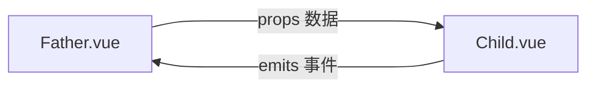
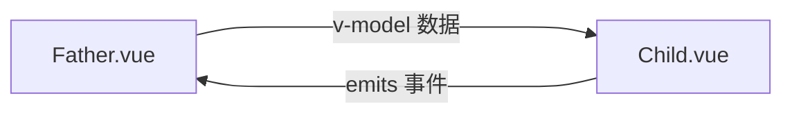

# 组件之间的通信

经过前面的那几部分的阅读，相信搭一个基础的 Vue 3.0 项目应该没什么问题了！

但实际业务开发过程中，还会遇到一些组件之间的通信问题，父子组件通信、兄弟组件通信、爷孙组件通信，还有一些全局通信的场景。

:::tip
这一章节的内容，`3.x` 对比 `2.x` 变化都比较大！
:::

这一章就按使用场景来划分对应的章节吧，在什么场景下遇到问题，也方便快速找到对应的处理办法。

## 父子组件通信

父子组件通信是指，B组件引入到A组件里渲染，此时A是B的父级；B组件的一些数据需要从A组件拿，B组件有时也要告知A组件一些数据变化情况。

常用的方法有：

成对方法名|父组件向子组件|子组件向父组件|对应章节传送门
:--|:--|:--|:--
props / emits|props|emits|[点击查看](#props-emits)
v-model / emits|v-model|emits|[点击查看](#v-model-emits)

为了方便阅读，下面的父组件统一叫 `Father.vue`，子组件统一叫 `Child.vue`。

:::warning
在 `2.x`，有的同学可能喜欢用 `$attrs / $listeners` 来进行通信，但该方案在 `3.x` 已经移除了，详见 [移除 $listeners](https://v3.cn.vuejs.org/guide/migration/listeners-removed.html)
:::

## props / emits

这是Vue跨组件通信最常用，也是基础的一个方案，它的通信过程是：

1. `Father.vue` 通过 `prop` 向 `Child.vue` 传值（可包含父级定义好的函数）

2. `Child.vue` 通过 `emit` 向 `Father.vue` 触发父组件的事件执行

画成一个流程图理解起来会比较直观一些：



### 下发 props

下发的过程是在 `Father.vue` 里完成的，父组件在向子组件下发 `props` 之前，需要导入子组件并启用它作为自身的模板，然后在 `setup` 里处理好数据，return 给 `template` 用。

在 `Father.vue` 的 `script` 里：

```ts
import { defineComponent } from 'vue'
import Child from '@cp/Child.vue'

interface Member {
  id: number,
  name: string
};

export default defineComponent({
  // 需要启用子组件作为模板
  components: {
    Child
  },

  // 定义一些数据并return给template用
  setup () {
    const userInfo: Member = {
      id: 1,
      name: 'Petter'
    }

    // 不要忘记return，否则template拿不到数据
    return {
      userInfo
    }
  }
})
```

然后在 `Father.vue` 的 `template` 这边拿到 return 出来的数据，把要传递的数据通过属性的方式绑定在 `template` 的组件标签上。

```vue
<template>
  <Child
    title="用户信息"
    :index="1"
    :uid="userInfo.id"
    :user-name="userInfo.name"
  />
</template>
```

这样就完成了 `props` 数据的下发。

:::tip
1. 在 `template` 绑定属性这里，如果是普通的字符串，比如上面的 `title`，则直接给属性名赋值就可以

2. 如果是变量，或者其他类型如 `Number`、`Object` 等，则需要通过属性动态绑定的方式来添加，使用 `v-bind:` 或者 `:` 符号进行绑定

3. 官方建议 prop 在 `template` 统一采用短横线分隔命名 （详见：[Prop 的大小写命名](https://v3.cn.vuejs.org/guide/component-props.html#prop-%E7%9A%84%E5%A4%A7%E5%B0%8F%E5%86%99%E5%91%BD%E5%90%8D-camelcase-vs-kebab-case)），但实际上你采用驼峰也是可以正确拿到值，因为 Vue 的源码里有做转换
:::

### 接收 props

接收的过程是在 `Child.vue` 里完成的，在 `script` 部分，子组件通过与 `setup` 同级的 `props` 来接收数据。

它可以是一个数组，每个 `item` 都是 `String` 类型，把你要接受的变量名放到这个数组里，直接放进来作为数组的 `item`：

```ts
export default defineComponent({
  props: [
    'title',
    'index',
    'userName',
    'uid'
  ]
})
```

但这种情况下，使用者不知道这些属性到底是什么类型的值，是否必传。

### 带有类型限制的 props

> 注：这一小节的步骤是在 `Child.vue` 里操作。

既然我们最开始在决定使用 Vue 3.0 的时候，为了更好的类型限制，已经决定写 `TypeScript` ，那么我们最好不要出现这种使用情况。

**推荐的方式是把 `props` 定义为一个对象，以对象形式列出 `prop`，每个 `property` 的名称和值分别是 `prop` 各自的名称和类型，只有合法的类型才允许传入。**

:::tip
注意，和 ts 的类型定义不同， `props` 这里的类型，首字母需要大写。
:::

支持的类型有：

类型|含义
:--|:--
String|字符串
Number|数值
Boolean|布尔值
Array|数组
Object|对象
Date|日期数据，e.g. new Date()
Function|函数，e.g. 普通函数、箭头函数、构造函数
Promise|Promise类型的函数
Symbol|Symbol类型的值

于是我们把 `props` 再改一下，加上类型限制：

```ts
export default defineComponent({
  props: {
    title: String,
    index: Number,
    userName: String,
    uid: Number
  }
})
```

这样我们如果传入不正确的类型，程序就会抛出警告信息，告知开发者必须正确传值。

如果你需要对某个 `prop` 允许多类型，比如这个 `uid` 字段，它可能是数值，也可能是字符串，那么可以在类型这里，使用一个数组，把允许的类型都加进去。

```ts
export default defineComponent({
  props: {
    // 单类型
    title: String,
    index: Number,
    userName: String,

    // 这里使用了多种类型
    uid: [ Number, String ]
  }
})
```

### 可选以及带有默认值的 props

> 注：这一小节的步骤是在 `Child.vue` 里操作。

有时候我们想对一些 `prop` 设置为可选，然后提供一些默认值，还可以再将 `prop` 再进一步设置为对象，支持的字段有：

字段|类型|含义|
:--|:--|:--
type|string|prop 的类型
required|boolean|是否必传，true=必传，false=可选
default|any|与 type 字段的类型相对应的默认值，如果 required 是 false ，但这里不设置默认值，则会默认为 `undefined`
validator|function|自定义验证函数，需要 return 一个布尔值，true=校验通过，false=校验不通过，当校验不通过时，控制台会抛出警告信息

我们现在再对 `props` 改造一下，对部分字段设置为可选，并提供默认值：

```ts
export default defineComponent({
  props: {
    // 可选，并提供默认值
    title: {
      type: String,
      required: false,
      default: '默认标题'
    },

    // 强制必传
    index: Number,

    // 添加一些自定义校验
    userName: {
      type: String,

      // 在这里校验用户名必须至少3个字
      validator: v => v.length >= 3
    },

    // 强制必传，但允许多种类型
    uid: [ Number, String ]
  }
})
```

### 使用 props{new}

> 注：这一小节的步骤是在 `Child.vue` 里操作。

在 `template` 部分，`3.x` 的使用方法和 `2.x` 是一样的，比如要渲染我们上面传入的 `props` ：

```vue
<template>
  <p>标题：{{ title }}</p>
  <p>索引：{{ index }}</p>
  <p>用户id：{{ uid }}</p>
  <p>用户名：{{ userName }}</p>
</template>
```

**但是 `script` 部分，变化非常大！**

在 `2.x` ，只需要通过 `this.uid`、`this.userName` 就可以使用父组件传下来的 `prop` 。

但是 `3.x` 没有了 `this`， 需要给 `setup` 添加一个入参才可以去操作。

```ts
export default defineComponent({
  props: {
    title: String,
    index: Number,
    userName: String,
    uid: Number
  },

  // 在这里需要添加一个入参
  setup (props) {

    // 该入参包含了我们定义的所有props
    console.log(props);

  }
})
```

:::tip
1. `prop` 是只读，不允许修改

2. `setup` 的第一个入参，包含了我们定义的所有props（如果在 `Child.vue` 里未定义，但 父组件 `Father.vue` 那边非要传过来的，不会拿到，且控制台会有警告信息）

3. 该入参可以随意命名，比如你可以写成一个下划线 `_`，通过 `_.uid` 也可以拿到数据，但是语义化命名，是一个良好的编程习惯。
:::

### 传递非 Prop 的 Attribute

上面的 tip 里有提到一句：

> 如果在 `Child.vue` 里未定义，但 父组件 `Father.vue` 那边非要传过来的，不会拿到，且控制台会有警告信息

但并不意味着你不能传递任何未定义的属性数据，在父组件，除了可以给子组件绑定 props，你还可以根据实际需要去绑定一些特殊的属性。

比如给子组件设置 `class`、`id`，或者 `data-xxx` 之类的一些自定义属性，**如果 `Child.vue` 组件的 `template` 只有一个根节点，这些属性默认自动继承，并渲染在 node 节点上**。

在 `Father.vue` 里，对 `Child.vue` 传递了 `class`、`id` 和 `data-hash`：

```vue
<template>
  <Child
    class="child"
    keys="aaaa"
    data-hash="afJasdHGUHa87d688723kjaghdhja"
  />
</template>
```

渲染后（2个 `data-v-xxx` 是父子组件各自的 `css scoped` 标记）：

```html
<div
  class="child"
  keys="aaaa"
  data-hash="afJasdHGUHa87d688723kjaghdhja"
  data-v-2dcc19c8=""
  data-v-7eb2bc79=""
>
  <!-- Child的内容 -->
</div>
```

你可以在 `Child.vue` 配置 `inheritAttrs` 为 `false`，来屏蔽这些自定义属性的渲染。

```ts
export default defineComponent({
  inheritAttrs: false,
  setup () {
    // ...    
  }
})
```

### 获取非 Prop 的 Attribute{new}

想要拿到这些属性，原生操作需要通过 `element.getAttribute` ，但 Vue 也提供了相关的 api ：

在 `Child.vue` 里，可以通过 `setup` 的第二个参数里的 `attrs` 来获取到这些属性。

```ts
export default defineComponent({
  setup (props, { attrs }) {
    // attrs是个对象，每个Attribute都是它的key
    console.log(attrs.class);

    // 如果传下来的Attribute带有短横线，需要通过这种方式获取
    console.log(attrs['data-hash']);
  }
})
```

:::tip
1. `attr` 和 `prop` 一样，都是只读的

2. 不管 `inheritAttrs` 是否设置，都可以通过 `attrs` 拿到这些数据，但是 `element.getAttribute` 则只有 `inheritAttrs` 为 `true` 的时候才可以。
:::

`Vue 3.x` 的 `template` 还允许多个根节点，多个根节点的情况下，无法直接继承这些属性，需要在 `Child.vue` 指定继承在哪个节点上，否则会有警告信息。

```vue
<template>
  <!-- 指定继承 -->
  <p v-bind="attrs"></p>
  <!-- 指定继承 -->
  
  <!-- 这些不会自动继承 -->
  <p></p>
  <p></p>
  <p></p>
  <!-- 这些不会自动继承 -->
</template>
```

当然，前提依然是，`setup` 里要把 `attrs` 给 `return` 出来。

查看详情：[多个根节点上的 Attribute 继承](https://v3.cn.vuejs.org/guide/component-attrs.html#%E5%A4%9A%E4%B8%AA%E6%A0%B9%E8%8A%82%E7%82%B9%E4%B8%8A%E7%9A%84-attribute-%E7%BB%A7%E6%89%BF)

### 绑定 emits{new}

最开始有介绍到，子组件如果需要向父组件告知数据更新，或者执行某些函数时，是通过 emits 来进行的。

每个 `emit` 都是事件，所以需要先由父组件先给子组件绑定，子组件才能知道应该怎么去调用。

:::tip
当然，父组件也是需要先在 `setup` 里进行定义并 `return`，才能够在 `template` 里绑定给子组件。
:::

比如要给 `Child.vue` 绑定一个更新用户年龄的方法，那么在 `Father.vue` 里需要这么处理：

先看 `script` 部分（留意注释部分）：

```ts
import { defineComponent, reactive } from 'vue'
import Child from '@cp/Child.vue'

interface Member {
  id: number,
  name: string,
  age: number
};

export default defineComponent({
  components: {
    Child
  },
  setup () {
    const userInfo: Member = reactive({
      id: 1,
      name: 'Petter',
      age: 0
    })

    // 定义一个更新年龄的方法
    const updateAge = (age: number): void => {
      userInfo.age = age;
    }

    return {
      userInfo,

      // return给template用
      updateAge
    }
  }
})
```

再看 `template` 部分（为了方便阅读，我把之前绑定的 props 先去掉了）：

```vue
<template>
  <Child
    @update-age="updateAge"
  />
</template>
```

:::tip
1. 动态绑定 `props` 是用 `:`，绑定 `emit` 是用 `@`

2. 关于绑定的这个 `@` 符号，其实很好记忆，因为在 Vue 的 `template` 里，所有的事件绑定都是通过 `@`，比如 `@click`、`@change` 等等

3. 同样的，在绑定 `emit` 时，也需要使用短横线写法（详见：[事件名](https://v3.cn.vuejs.org/guide/component-custom-events.html#%E4%BA%8B%E4%BB%B6%E5%90%8D)）
:::

### 接收 emits

> 注：这一小节的步骤是在 `Child.vue` 里操作。

和 `props` 一样，你可以指定是一个数组，把要接收的 `emit` 名称写进去：

```ts
export default defineComponent({
  emits: [
    'update-age'
  ]
})
```

其实日常这样配置就足够用了。

:::tip
1. 这里的 `emit` 名称指 `Father.vue` 在给 `Child.vue` 绑定事件时，`template` 里面给子组件指定的 `@aaaaa="bbbbb"` 里的 `aaaaa`

2. 当在 emits 选项中定义了原生事件 (如 `click` ) 时，将使用组件中的事件替代原生事件侦听器
:::

### 接收 emits 时做一些校验

当然你也可以对这些事件做一些验证，配置为对象，然后把这个 `emit` 名称作为 `key`， `value` 则配置为一个方法。

比如上面的更新年龄，只允许达到成年人的年龄才会去更新父组件的数据：

```ts
export default defineComponent({
  emits: {
    // 需要校验
    'update-age': (age: number) => {
      // 写一些条件拦截，记得返回false
      if ( age < 18 ) {
        console.log('未成年人不允许参与');
        return false;
      }

      // 通过则返回true
      return true;
    },

    // 一些无需校验的，设置为null即可
    'update-name': null
  }
})
```

### 调用 emits{new}

> 注：这一小节的步骤是在 `Child.vue` 里操作。

和 `props` 一样，也需要在 `setup` 的入参里引入 `emit` ，才允许操作。

`setup` 的第二个入参 `expose` 是一个对象，你可以完整导入 `expose` 然后通过 `expose.emit` 去操作，也可以按需导入 `{ emit }` （推荐这种方式）：

```ts
export default defineComponent({
  emits: [
    'update-age'
  ],
  setup (props, { emit }) {
    
    // 2s后更新年龄
    setTimeout( () => {
      emit('update-age', 22);
    }, 2000);

  }
})
```

:::tip
`emit` 的第二个参数开始是父组件那边要接收的自定义数据，为了开发上的便利，建议如果需要传多个数据的情况下，直接将第二个参数设置为一个对象，把所有数据都放到对象里，传递和接收起来都会方便很多。
:::

## v-model / emits

对比 `props / emits` ，这个方式更为简单：

1. 在 `Father.vue` ，通过 `v-model` 向 `Child.vue` 传值

2. `Child.vue` 通过自身设定的 emits 向 `Father.vue` 通知数据更新

这里也画一个流程图来加强理解：



`v-model` 的用法和 `props` 非常相似，但是很多操作上更为简化，但操作简单带来的 “副作用” ，就是功能上也没有 `props` 那么多。

### 绑定 v-model{new}

它的和下发 props 的方式类似，都是在子组件上绑定 `Father.vue` 定义好并 `return` 出来的数据。

:::tip
1. 和 `2.x` 不同， `3.x` 可以直接绑定 `v-model` ，而无需在子组件指定 `model` 选项。

2. 另外，`3.x` 的 `v-model` 需要使用 `:` 来指定你要绑定的属性名，同时也开始支持绑定多个 `v-model`
:::

我们来看看具体的操作：

```vue
<template>
  <Child
    v-model:user-name="userInfo.name"
  />
</template>
```

如果你要绑定多个数据，写多个 `v-model` 即可

```vue
<template>
  <Child
    v-model:user-name="userInfo.name"
    v-model:uid="userInfo.id"
  />
</template>
```

看到这里应该能明白了，一个 `v-model` 其实就是一个 `prop`，它支持的数据类型，和 `prop` 是一样的。

所以，子组件在接收数据的时候，完全按照 `props` 去定义就可以了。

点击回顾：[接收 props](#接收-props) ，了解在 `Child.vue` 如何接收 `props`，以及相关的 `props` 类型限制等部分内容。

### 配置 emits

> 注：这一小节的步骤是在 `Child.vue` 里操作。

虽然 `v-model` 的配置和 `prop` 相似，但是为什么出这么两个相似的东西？自然是为了简化一些开发上的操作。

使用 props / emits，如果要更新父组件的数据，还需要在父组件定义好方法，然后 `return` 给 `template` 去绑定事件给子组件，才能够更新。

而使用 `v-model / emits` ，无需如此，可以在 `Child.vue` 直接通过 “update:属性名” 的格式，直接定义一个更新事件：

```ts
export default defineComponent({
  props: {
    userName: String,
    uid: Number
  },
  emits: [
    'update:userName',
    'update:uid'
  ]
})
```

btw: 这里的 update 后面的属性名，支持驼峰写法，这一部分和 `2.x` 的使用是相同的。

这里也可以对数据更新做一些校验，配置方式和 [接收 emits 时做一些校验](#接收-emits-时做一些校验) 是一样的。

### 调用自身的 emits{new}

> 注：这一小节的步骤是在 `Child.vue` 里操作。

在 `Child.vue` 配置好 emits 之后，就可以在 `setup` 里直接操作数据的更新了：

```ts
export default defineComponent({
  // ...
  setup (props, { emit }) {

    // 2s后更新用户名
    setTimeout(() => {
      emit('update:userName', 'Tom')
    }, 2000);

  }
})
```

在使用上，和 [调用 emits](#调用-emits-new) 是一样的。

## 兄弟组件通信

待完善

## 爷孙组件通信

待完善

## 全局通信

待完善

## 本节结语

待完善